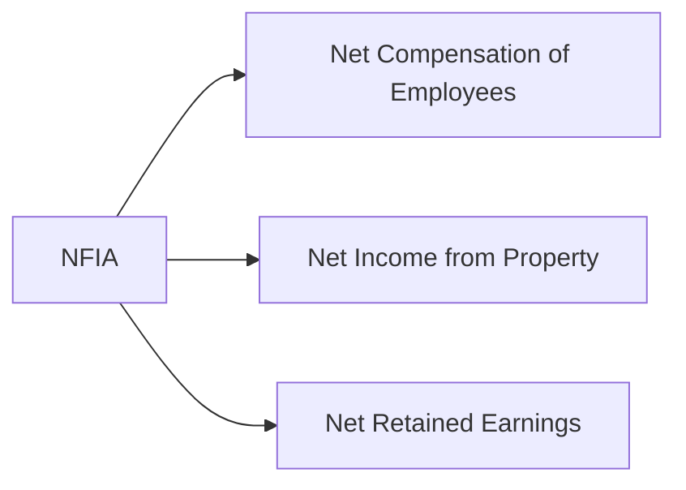

#DONE 

related to [[session 20 Macroeconomics Lecture Analysis and Questions.pdf]]

**Exogenous Variables** (independent/given):

- Determined _outside_ the economic model
- Treated as inputs that the model cannot explain

**Endogenous Variables** (dependent/determined):

- Determined _within_ the economic model by the interactions of other variables
- What the model seeks to explain
- Examples: GDP, consumption, investment, interest rates, employment, inflation, wages, aggregate demand/supply

**Example in IS-LM Model:**

- **Exogenous**: Government spending (G), money supply (M), tax policy
- **Endogenous**: GDP (Y), interest rate (r), consumption (C), investment (I)

---

Gross Domestic Product (GDP) is defined as the market value of all final goods and services produced within the domestic territory of a country during a given period.4 It is a measure of productive capacity located within a specific geography, regardless of who owns the factors of production.

Gross National Product (GNP), in contrast, measures the market value of all final goods and services produced by the nationals (residents) of a country, regardless of where that production takes place.4 The bridge between these two measures is Net Factor Income from Abroad (NFIA).

$$GNP = GDP + NFIA$$

1. **Net Compensation of Employees**: This captures wages and salaries earned by residents working abroad (e.g., Indian IT professionals on short-term assignments in the US) minus the compensation paid to non-residents working within the domestic economy. 
2. **Net Income from Property and Entrepreneurship**: This includes rent, interest, and profits. For a developing nation that hosts significant Foreign Direct Investment (FDI), this component is often negative, as profits are repatriated to foreign parent companies. Conversely, nations with substantial external assets earn positive income here. 
3. **Net Retained Earnings**: This often-overlooked component accounts for the difference between the retained earnings of resident companies located abroad and the retained earnings of non-resident companies operating domestically.

---
$$
GDP_{\text{Market Price}} = GDP_{\text{Factor Cost}} + \text{Indirect Taxes} - \text{Subsidies}
$$

can also be expressed as:

$$
GDP_{\text{Market Price}} = GDP_{\text{Factor Cost}} + \text{Net Indirect taxes}
$$

where:  $\text{Net Indirect Taxes} = \text{Indirect Taxes} - \text{Subsidies}$

---

3 approaches to measure national income:

1. Product Approach (Value Added): Summing the value added at each stage of production to avoid double counting.
2. Income Approach: Summing all factor incomes generated in production (Wages + Rent + Interest + Profit).
3. Expenditure Approach: Summing all final expenditures on goods and services ($C + I + G + NX$).

---

In the short run, equilibrium is determined by Aggregate Demand

The Goods Market and the IS curve

**Plot 1 - Goods Market Equilibrium**: The 45-degree diagram shows where aggregate demand (AD = C + I + G) intersects the 45-degree line (Y = AD), determining equilibrium income Y*.

![[Pasted image 20251218073301.png]]

**Plot 2 - IS Curve**: Shows the negative relationship between interest rates and income. Higher interest rates reduce investment, which reduces equilibrium income.

![[Pasted image 20251218073627.png]]

**Plot 3 - IS Curve Shifts**: Demonstrates how increases in government spending (G) shift the IS curve rightward, increasing equilibrium income at each interest rate.

![[Pasted image 20251218073855.png]]

The IS (Investment-Savings) curve represents combinations of the real interest rate ($r$) and real output ($Y$) where the goods market is in equilibrium. The fundamental identity is: $$Y = C(Y-T) + I(r) + G$$Where: 
- $C(Y-T)$ is consumption as a function of disposable income. 
- $I(r)$ is investment, inversely related to the real interest rate. i.e. $I_r < 0$
- $G$ is exogenous government spending. 

The curve slopes downward because a lower interest rate reduces the cost of borrowing, stimulating investment ($I$), which increases aggregate demand and, through the multiplier effect, raises output ($Y$).

![[Pasted image 20251218074720.png]]

![[Pasted image 20251218074734.png]]

The Money Market and LM curve

The LM (Liquidity-Money) curve represents equilibrium in the money market, where the supply of real money balances equals the demand for real money balances.

$$M/P = L(Y, i)$$

![[Pasted image 20251218075851.png]]

![[Pasted image 20251218075906.png]]

![[Pasted image 20251218075921.png]]

The curve slopes upward because an increase in income ($Y$) raises the transaction demand for money. With a fixed money supply ($M/P$), the interest rate ($i$) must rise to increase the opportunity cost of holding money, thereby clearing the market.

alternative way to think about this:
![[Pasted image 20251218080109.png]]

On crowding out...

![[Pasted image 20251218110649.png]]

![[Pasted image 20251218110704.png]]

The case of complete crowding out

![[Pasted image 20251218111500.png]]

The case of zero crowding out

![[Pasted image 20251218111538.png]]

![[Pasted image 20251218111738.png]]

| Exchange Rate Regime | Fiscal Policy    | Monetary Policy | Mechanism                                                                                                                                                                                                                              |
| -------------------- | ---------------- | --------------- | -------------------------------------------------------------------------------------------------------------------------------------------------------------------------------------------------------------------------------------- |
| Flexible (Floating)  | Ineffective      | Effective       | Fiscal expansion $\rightarrow$ $i \uparrow$ $\rightarrow$ Capital Inflow $\rightarrow$ Appreciation $\rightarrow$ Net Exports $\downarrow$. (Crowding out via trade).                                                                  |
| Fixed (Pegged)       | Highly Effective | Ineffective     | Fiscal expansion $\rightarrow$ $i \uparrow$ $\rightarrow$ Capital Inflow $\rightarrow$ Pressure to Appreciate. Central Bank sells domestic currency ($M \uparrow$) to maintain peg. Monetary accommodation reinforces fiscal stimulus. |

On Flexible exchange rate regimes. Fiscal policy is ineffective but the monetary policy is effective.

![[Pasted image 20251218113030.png]]

![[Pasted image 20251218113931.png]]

On Fixed exchange rate regimes. Fiscal policy is effective but monetary policy is ineffective.

![[Pasted image 20251218114451.png]]

![[Pasted image 20251218114801.png]]

---

Debt Sustainability Analysis ($r - g$) 

The core condition for debt sustainability is the differential between the real interest rate ($r$) and the real growth rate ($g$). 
The Condition: $\Delta d_t = (r - g)d_{t-1} - pb_t$ 
(where $d$ is debt ratio, $pb$ is primary balance). 

India's Advantage: India currently benefits from a negative $(r-g)$ differential (growth exceeds interest rates). This allows the debt-to-GDP ratio to stabilize even while running a primary deficit. 

However, experts warn that this relies on maintaining high growth; any structural slowdown or spike in interest rates (due to global tightening or domestic inflation) could flip the dynamic to an unsustainable path.

State-Level Stress: While the Centre consolidates, several states (Punjab, West Bengal, Kerala) face unsustainable debt burdens due to high committed expenditures (salaries, pensions, interest) and low own-revenue generation.

On the derivation of the above formula:

![[Pasted image 20251218120712.png]]

![[Pasted image 20251218120728.png]]

![[Pasted image 20251218120742.png]]

Long Run: Solow Model

While IS-LM and Mundell-Fleming address short-run fluctuations, long-run prosperity is determined by the Solow Growth Model.

The Model: Output ($Y$) is a function of Capital ($K$), Labor ($L$), and Technology ($A$). 
$$Y = A F(K, L)$$

Steady State: Due to diminishing returns to capital, an economy eventually reaches a "Steady State" where capital accumulation (investment) exactly equals depreciation. At this point, growth in capital per worker stops.

Technological Progress: The only driver of sustained growth in living standards (output per worker) in the long run is exogenous technological progress ($g_A$), also known as the Solow Residual or Total Factor Productivity (TFP).

Policy Implication: To achieve long-term growth, countries cannot rely solely on capital accumulation (savings); they must foster innovation and efficiency. This connects back to Modern Supply-Side Economics, which advocates for R&D and education to boost this $A$ term.

---

